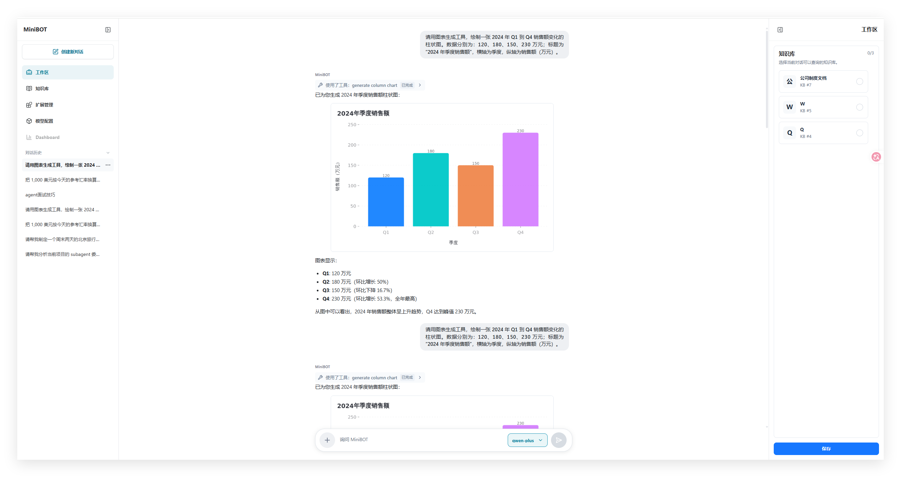
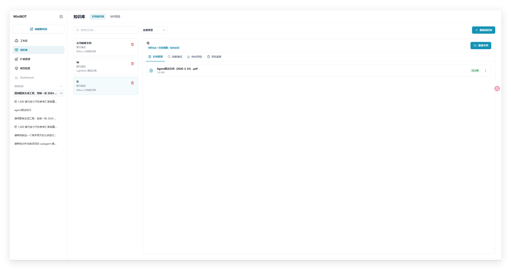
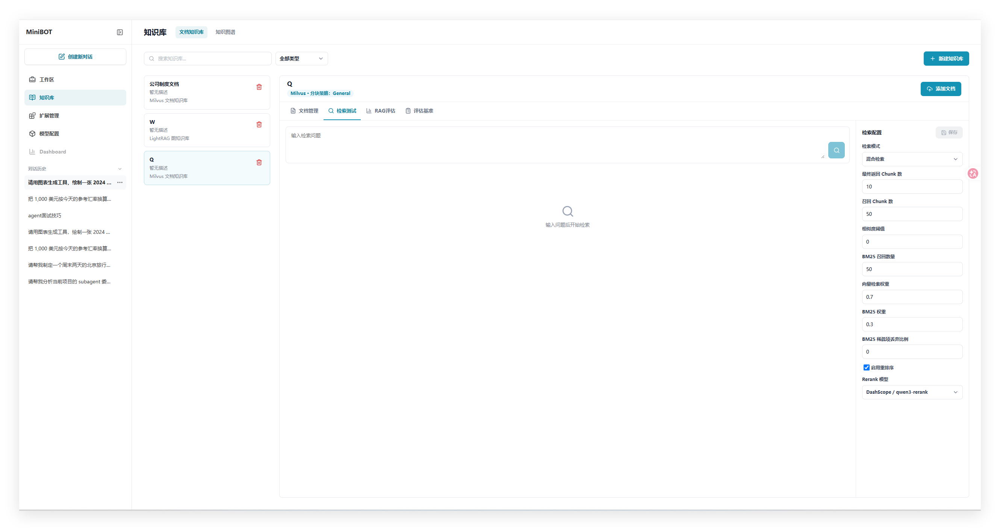
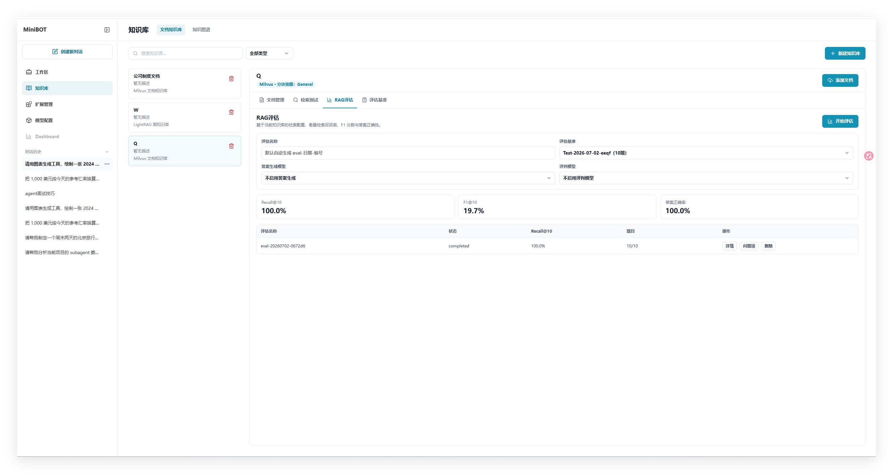
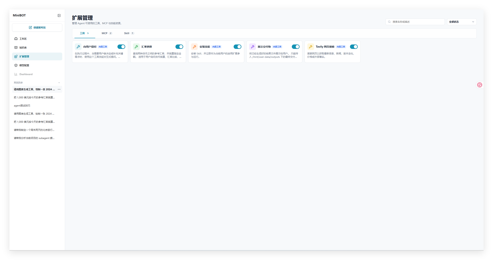
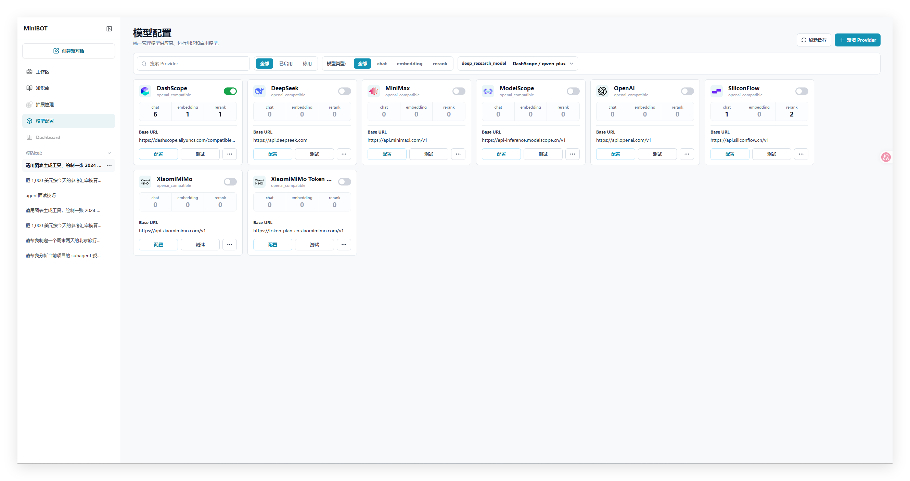
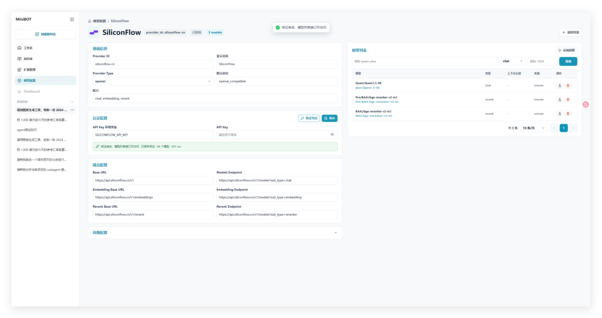
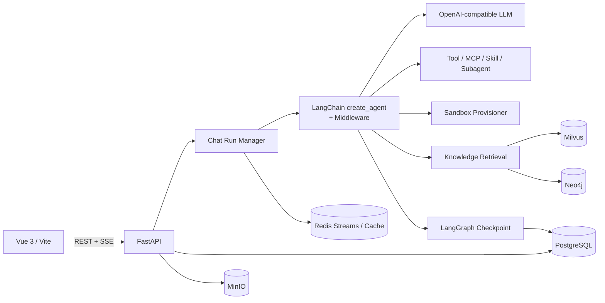

# miniBOT

miniBOT 是一个可扩展的 AI Agent 全栈脚手架，致力于降低复杂智能体应用的开发与集成成本。项目以 Vue 3 和 FastAPI 为基础，通过 LangChain、LangGraph、Middleware 与统一资源注册体系，将大模型、MCP、Tool、Skill、Subagent、知识库和受控沙盒整合进同一运行时，覆盖对话持久化、资源编排、子任务执行、知识检索及上下文治理等核心能力。


## 功能概览

- **持久化智能对话**：会话、消息与 Agent Run 保存到 PostgreSQL；异步 Run 通过 Redis Stream 推送事件，支持 SSE 断线续传和页面刷新后恢复订阅。
- **Agent 资源编排**：统一管理内置 Tool、外置 Tool、MCP 和 Skill；Skill 激活后可按依赖关系动态加载工具。
- **Subagent 子任务**：父 Agent 可将独立任务并发委派给 Subagent，并通过逻辑线程和 LangGraph checkpoint 隔离、审计及续跑。
- **统一知识库架构**：Milvus 负责文档主索引和图向量召回，Neo4j 负责图拓扑扩展，PostgreSQL 保存权威元数据。
- **文档解析与分块**：支持 Markdown、TXT、PDF、DOCX、XLSX、CSV，内置 General、QA、Book、Laws、Separator 等分块策略。
- **检索配置与评估**：可配置 embedding、rerank 和查询参数，并支持评估数据集生成、上传与运行记录。
- **模型配置中心**：模型 Provider、模型清单和用途配置保存到 PostgreSQL，并通过 Redis 缓存；支持多种 OpenAI-compatible Provider。
- **受控 Agent 沙盒**：按用户和会话延迟创建 Docker 沙盒，提供受限文件能力，并隔离 workspace、uploads、outputs 和 skills。
- **上下文治理**：支持长上下文滚动摘要、工具输出预算与大结果卸载，降低模型上下文被工具结果挤占的风险。

## 界面预览

### 智能对话

> **智能对话主界面**
>
> 

### 知识库管理

> **知识库创建、文档管理与检索测试**
>
> 
> 
> 

### 扩展管理

> **Tool、MCP 与 Skill 管理**
>
> 

### 模型配置

> **Provider、模型与模型用途配置**
>
> 
> 

## 系统架构



核心数据流：

1. 前端创建异步聊天 Run，并订阅对应的 SSE 事件流。
2. 后端持久化用户消息和父 Agent Run，后台任务独立执行 Agent。
3. Runtime 读取会话、模型用途、知识库范围和已启用扩展，构建 `AgentContext`。
4. `create_agent` 创建父 Agent；middleware 负责 Skill、知识库、Subagent、沙盒、上下文摘要和工具输出治理。
5. 模型 token、工具状态和 Subagent 事件写入 Redis Stream；最终消息与运行状态写回 PostgreSQL。
6. LangGraph checkpoint 使用逻辑线程保存父 Agent 与 Subagent 状态，支持会话和子任务续跑。

更完整的目录、API 和调用链说明请查看 [PROJECT_MAP.md](PROJECT_MAP.md)。Agent 开发约定请查看 [AGENTS.md](AGENTS.md)。

## 技术栈

| 层级 | 主要技术 |
| --- | --- |
| 前端 | Vue 3、Vite、JavaScript、Lucide Icons、markdown-it、highlight.js |
| API | FastAPI、Pydantic Settings、Uvicorn |
| Agent | LangChain、LangGraph、LangGraph PostgreSQL Checkpointer、MCP Adapters |
| 数据 | PostgreSQL、SQLAlchemy Async、Redis |
| 对象存储 | MinIO |
| 知识库 | Milvus、Neo4j、PostgreSQL、OpenAI-compatible Embedding / Rerank |
| 沙盒 | Docker、独立 Sandbox Provisioner、agent-sandbox |

## 快速开始

### 1. 环境要求

- Git
- Python 与 `venv`
- Node.js 与 npm
- Docker Desktop 或其他支持 Docker Compose 的环境

以下命令以 Windows PowerShell 为例。

### 2. 获取代码并准备配置

```powershell
git clone https://github.com/ZeRo123o/miniBOT.git
cd miniBOT
Copy-Item .env.example backend/.env
```

根据需要编辑 `backend/.env`：

- 数据库、Redis、MinIO、Milvus 和 Neo4j 的默认值与 `docker-compose.yml` 对齐。
- 使用真实模型时，将 Provider 密钥写入对应环境变量，例如 `DASHSCOPE_API_KEY` 或 `OPENAI_API_KEY`。
- 模型运行时由“模型配置页 → PostgreSQL → Redis cache”管理，Provider 配置通过 `api_key_env` 引用环境变量，不要把真实密钥提交到 Git。
- 非本地环境必须替换 `MINIBOT_SANDBOX_INTERNAL_TOKEN` 以及所有默认数据库和存储密码。

### 3. 启动基础依赖

一次启动全部服务：

```powershell
docker compose up -d
```

### 4. 启动后端

```powershell
cd backend
python -m venv .venv
.\.venv\Scripts\Activate.ps1
pip install -r requirements.txt
uvicorn app.main:app --reload
```

后端默认地址为 `http://127.0.0.1:8000`：

- 健康检查：`http://127.0.0.1:8000/api/health`
- OpenAPI 文档：`http://127.0.0.1:8000/docs`

### 5. 启动前端

打开另一个终端：

```powershell
cd frontend
npm install
npm run dev
```

访问 `http://localhost:5173`。Vite 开发服务器会将 `/api` 代理到 `http://127.0.0.1:8000`。

### 6. 配置并测试模型

1. 打开左侧导航中的“模型配置”。
2. 选择或新增 Provider，并确认 `api_key_env` 对应的密钥已写入 `backend/.env`。
3. 刷新远端模型或手动添加模型。
4. 测试模型调用，并将需要的模型绑定到 `chat_model` 用途。
5. 返回智能对话页面开始聊天。

创建知识库时需要配置可用的知识抽取模型与 embedding 模型；rerank 可按需启用。

## 主要模块

```text
miniBOT/
├── backend/
│   ├── app/
│   │   ├── agents/       # Agent、Subagent、middleware、toolkit 与 sandbox backend
│   │   ├── api/          # FastAPI 路由
│   │   ├── db/           # SQLAlchemy 模型、会话与通用 Repository
│   │   ├── knowledge/    # 解析、分块、embedding、rerank 与知识库 backend
│   │   ├── llm/          # 模型 Provider、运行时解析与缓存
│   │   ├── services/     # 会话、Chat Run、知识库和附件业务流程
│   │   └── storage/      # MinIO 与 Redis 存储抽象
│   ├── tests/            # 后端测试
│   └── requirements.txt
├── docker/
│   └── sandbox_provisioner/
├── frontend/
│   ├── src/apis/         # API 请求封装
│   ├── src/components/   # 页面与通用组件
│   ├── src/stores/       # 小型 reactive store
│   └── src/views/        # 页面组合
├── docker-compose.yml
├── .env.example
├── AGENTS.md
└── PROJECT_MAP.md
```

## 数据与运行时边界

| 数据 | 存储位置 |
| --- | --- |
| 会话、消息、模型配置、资源元数据、运行审计、知识图谱权威记录 | PostgreSQL |
| LangGraph 父/子线程状态 | PostgreSQL checkpoint tables |
| 异步 Run 事件、模型配置缓存 | Redis |
| 知识库原始文件与 Markdown 副本 | MinIO |
| Milvus Chunk 主索引、实体向量、关系向量 | Milvus |
| 图拓扑数据 | Neo4j |
| Agent 工作区、上传、输出和 Skill 挂载 | 会话隔离的 Docker 沙盒目录 |

知识库上传只创建 Milvus 主索引。图谱由用户在知识库的“图谱构建”页确认并锁定抽取配置后，
以独立后台任务构建；任务进度保存在 PostgreSQL，构建结果分别写入 PostgreSQL、Neo4j 和
Milvus 图向量集合。

Agent 只使用以下虚拟路径：

```text
/mnt/user-data/workspace   用户级共享，可写
/mnt/user-data/uploads     会话级，只读
/mnt/user-data/outputs     会话级，可写
/mnt/skills                当前会话可见 Skill，只读
```

## 开发与验证

后端语法与导入前检查：

```powershell
cd backend
.\.venv\Scripts\python.exe -m compileall app
```

如当前环境已安装 `pytest`，可运行现有后端测试：

```powershell
cd backend
.\.venv\Scripts\python.exe -m pytest
```

前端构建检查：

```powershell
cd frontend
npm run build
```

涉及 PostgreSQL、Redis、MinIO、Milvus、Neo4j、沙盒或 API 行为的修改，应启动对应服务后完成真实接口验证。

## 致谢

- [DeerFlow](https://github.com/bytedance/deer-flow) - 参考项目的沙盒设计


## 安全说明

- 项目当前没有正式认证系统，`user_id` 仍由客户端传入，不构成可信身份边界。
- `docker-compose.yml` 中的账号、密码和内部 token 均为本地开发默认值，部署前必须全部替换。
- Provider API Key 只应保存在环境变量或安全的密钥管理系统中，不要写入数据库公开字段、日志、聊天事件或 Git 历史。
- 沙盒 provisioner 可以访问 Docker socket，仅应运行在受信任的本地或隔离环境中。
- `backend/data/`、日志、上传文件、模型响应缓存和知识库内容都不应提交到版本库。

## 当前限制

- 尚未提供正式的用户认证、权限管理和多租户隔离。
- 数据库没有独立迁移系统，应用启动时主要通过 `create_all` 和兼容 SQL 初始化结构。
- 测试覆盖仍有限，真实能力依赖模型、embedding、rerank 和外部服务配置。
- 沙盒暂不提供通用 Bash、宿主机执行、warm pool 或 Kubernetes backend。

## 参与开发

欢迎通过 Issue 反馈问题或讨论设计，也欢迎提交 Pull Request。修改前建议先阅读 [AGENTS.md](AGENTS.md) 中的开发规范，并确保后端编译检查、相关测试和前端构建通过。

## 许可证

当前仓库尚未添加正式的开源许可证。在公开发布或接受外部贡献前，请先选择并添加 `LICENSE`，同时核对所有引用、改编代码及第三方依赖的许可证和署名要求。
